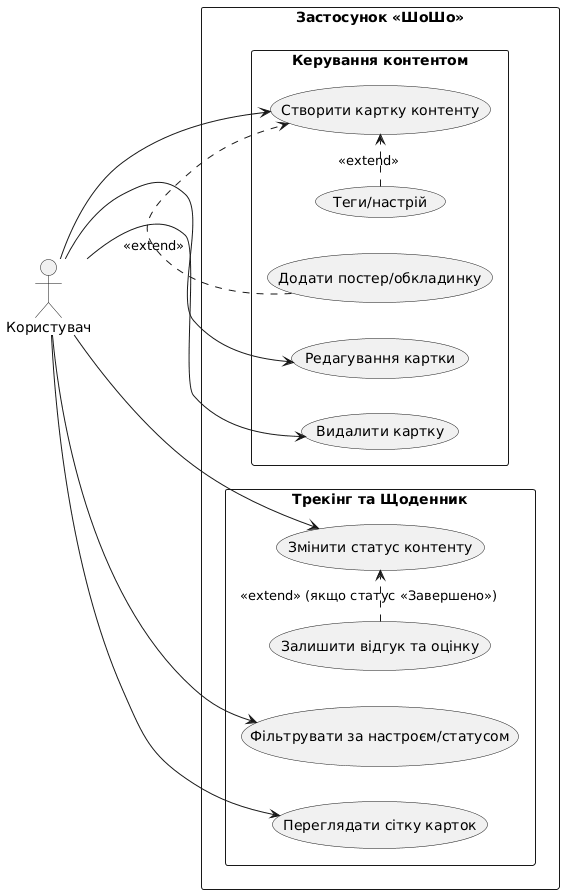
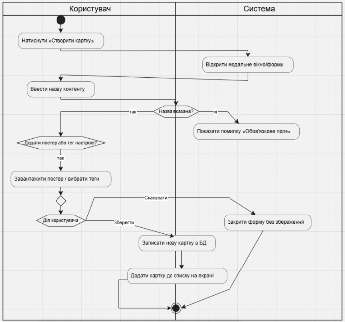
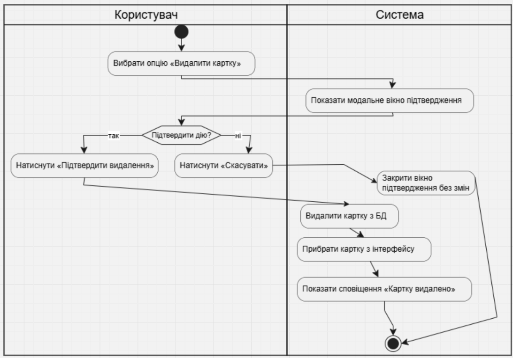
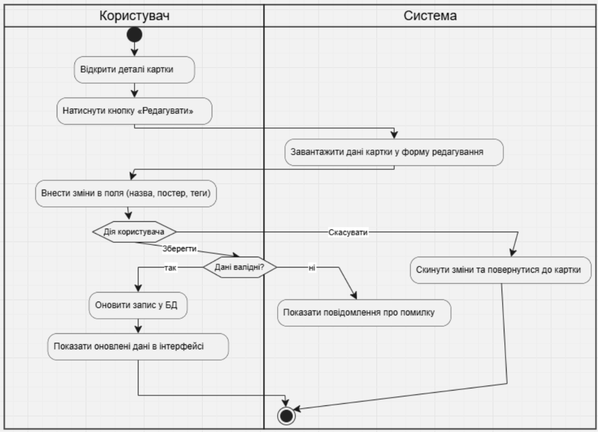
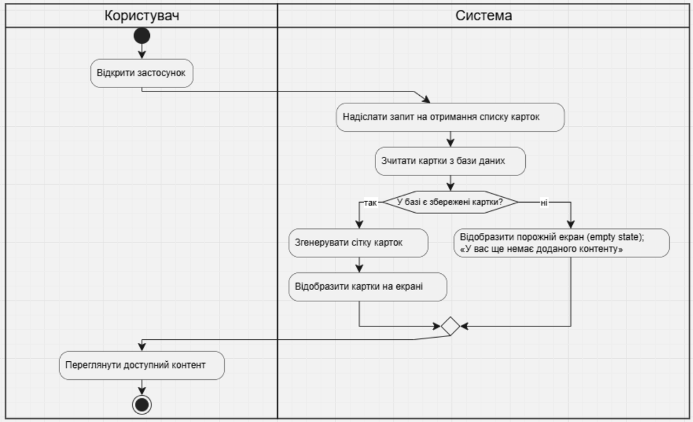
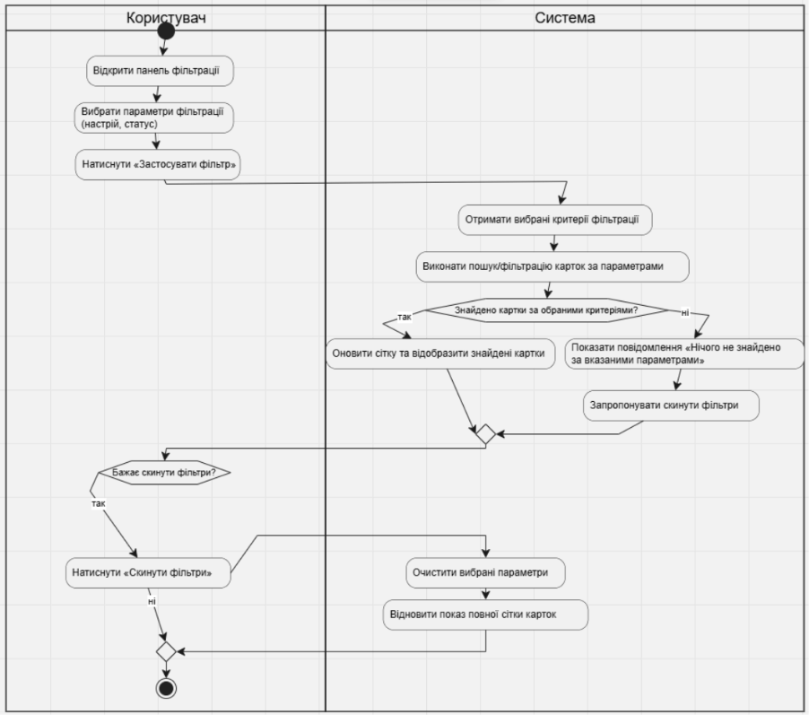
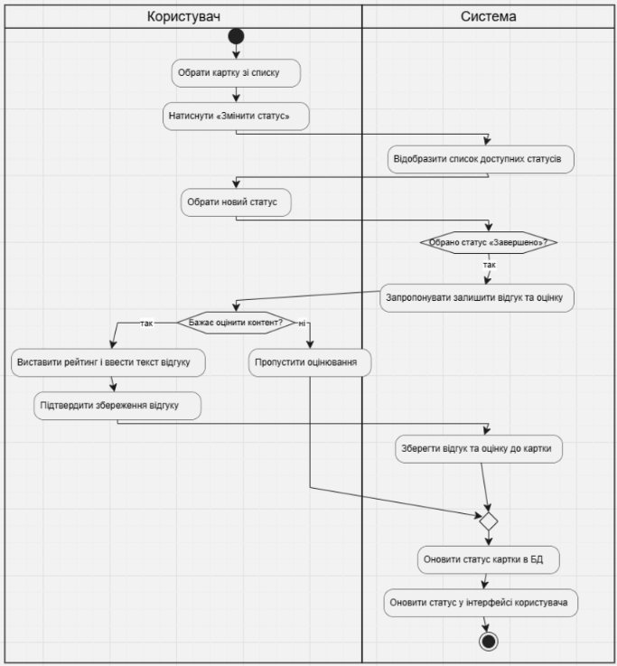

# Діаграми процесів та прецедентів

## Перелік діаграм

### 1. Загальна діаграма варіантів використання (`general`)

* **Опис:** Верхньорівнева діаграма прецедентів (Use Case), що відображає ключові сценарії взаємодії користувача із застосунком «ШоШо». Система розділена на два основні модулі — «Керування контентом» (створення, редагування, видалення карток, додавання обкладинок і тегів) та «Трекінг та Щоденник» (перегляд сітки, фільтрація, зміна статусів і написання відгуків).

---

### 2. Створення картки (`create`)

* **Опис:** Відображає покроковий сценарій валідації введених даних, обробки запиту сервером та збереження нового запису в базі даних.

---

### 3. Видалення картки (`delete`)

* **Опис:** Включає запит на підтвердження видалення, перевірку прав доступу, операцію видалення та сповіщення користувача.

---

### 4. Редагування картки (`edit`)

* **Опис:** Охоплює завантаження форми з поточними даними, валідацію оновлених значень та збереження змін.

---

### 5. Перегляд списку карток (`catalog`)

* **Опис:** Логіка отримання списку карток та первинне завантаження даних для клієнта.

---

### 6. Фільтрація за тегами (`filter`)

* **Опис:** Обробка параметрів фільтрів (вибір критеріїв, сортування), виконання запиту до сховища та оновлення інтерфейсу результатів.

---

### 7. Зміна статусу картки (`status`)

* **Опис:** Перевірка допустимості переходу між станами, оновлення статусу.
