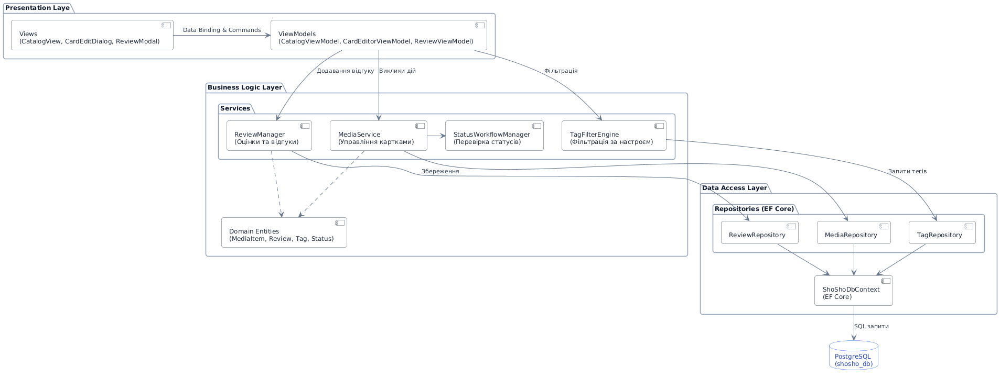
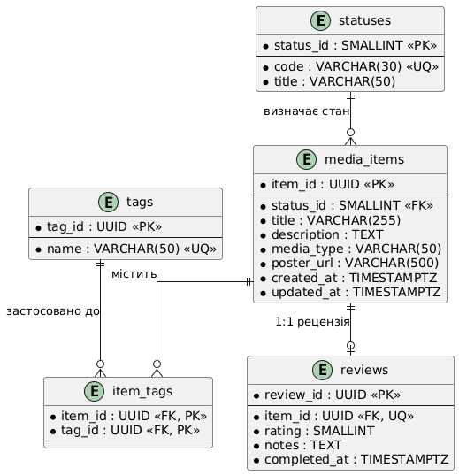

# Специфікація архітектури системи та моделі даних

## Зміст
1. [Архітектурна концепція](#1-архітектурна-концепція)
2. [Структура та модульність проєкту](#2-структура-та-модульність-проєкту)
3. [Специфікація підсистем та розподіл відповідальностей](#3-специфікація-підсистем-та-розподіл-відповідальностей)
4. [Схема потоків взаємодії компонентів](#4-схема-потоків-взаємодії-компонентів)
5. [Реляційна модель даних (PostgreSQL)](#5-реляційна-модель-даних-postgresql)
6. [Інженерне обґрунтування ключових рішень](#6-інженерне-обґрунтування-ключових-рішень)

---

## 1. Архітектурна концепція

Застосунок **«ШоШо»** спроєктовано як автономний локальний десктопний комплекс на базі платформи **.NET (C#)**. Архітектура рішення базується на принципах багатошарового моноліту (**Layered Desktop Architecture**) з чітким розмежуванням обов'язків між представленням, сервісними правилами та збереженням даних:

- **Рівень представлення (Presentation Layer):** Побудований за патерном **MVVM (Model-View-ViewModel)** засобами Windows Presentation Foundation (WPF). Забезпечує реактивне оновлення графічного інтерфейсу через механізм прив'язки даних (`Data Binding`), обробку користувацьких команд (`ICommand`) та відсутність бізнес-коду в розмітці.
- **Рівень доменної логіки (Business Logic Layer):** Ізольована C#-бібліотека без залежностей від графічного API. Реалізує доменні сервіси обробки контенту, правила зміни станів карток, фільтрацію медіа під настрій та розрахунок рейтингів.
- **Рівень доступу до даних (Data Access Layer):** Реалізований за допомогою **Entity Framework Core** у зв'язці з базою даних **PostgreSQL**. Інкапсулює виконання LINQ-запитів, зв'язування сутностей та контроль транзакцій через патерн репозиторіїв.

---
## 2. Структура та модульність проєкту

```text
ShoSho.sln
├── src/
│   ├── ShoSho.UI/                     # Presentation Layer (WPF)
│   │   ├── Views/                     # XAML форми (CatalogView, CardEditDialog, ReviewModal)
│   │   ├── ViewModels/                # MVVM контексти (CatalogViewModel, CardEditorViewModel)
│   │   └── Resources/                 # Стилі елементів керування, шаблони даних
│   │
│   ├── ShoSho.Core/                   # Domain & Business Logic Layer
│   │   ├── Entities/                  # Доменні моделі (MediaItem, Tag, Review, Status)
│   │   ├── Services/                  # Логіка (MediaService, TagFilterEngine, StatusWorkflowManager)
│   │   └── Contracts/                 # Інтерфейси репозиторіїв (IMediaRepository, ITagRepository)
│   │
│   └── ShoSho.Infrastructure/         # Data Access Layer
│       ├── Persistence/               # ShoShoDbContext, конфігурації Fluent API
│       ├── Repositories/              # Реалізація репозиторіїв на базі EF Core
│       └── Migrations/                # Файли міграцій структури PostgreSQL
└── docs/                              # Архітектурна документація та діаграми
```

---

## 3. Специфікація підсистем та розподіл відповідальностей

| Шар / Підсистема | Ключові модулі | Зона відповідальності |
| :--- | :--- | :--- |
| **Presentation (UI)** | `Views` (XAML)<br>`ViewModels`<br>`Converters` | Візуалізація сітки постерів, збір параметрів форми створення/редагування картки, взаємодія з буфером вводу користувача, маршрутизація модальних діалогів. |
| **Business Logic (Core)** | `MediaService`<br>`StatusWorkflowManager`<br>`TagFilterEngine`<br>`ReviewManager` | Перевірка допустимості переходів («В планах» → «В процесі» → «Завершено»), алгоритми перетину користувацьких тегів для вибірки під настрій, валідація діапазону оцінок (1–5) та тексту рецензій. |
| **Data Access (Infrastructure)** | `ShoShoDbContext`<br>`MediaRepository`<br>`TagRepository`<br>`ReviewRepository` | Побудова оптимізованих SQL-запитів до PostgreSQL, мапінг реляційних рядків у доменні сутності C#, виконання міграцій схеми та забезпечення цілісності зовнішніх ключів. |

## 4. Схема потоків взаємодії компонентів

Діаграма відображає вертикальний рух даних без використання мережевих посередників:



### Послідовність виконання операції збереження та фільтрації:
1. Дія користувача у `Views` транслюється через команду `ICommand` у відповідну `ViewModel`.
2. `ViewModel` викликає метод сервісу ядра (`MediaService` або `TagFilterEngine`), передаючи параметри операції.
3. Сервіс перевіряє доменні обмеження через `StatusWorkflowManager` та формує запит до інтерфейсу репозиторію.
4. Конкретна реалізація репозиторію в шарі `Infrastructure` звертається до `ShoShoDbContext`.
5. EF Core генерує параметризований SQL-запит і через локальне з'єднання записує або зчитує дані з PostgreSQL.
6. Отриманий результат повертається через ланцюжок назад у `ViewModel`, яка викликає сповіщення `PropertyChanged` для автоматичного перемальовування елементів WPF.

---

## 5. Реляційна модель даних



### Структура сутностей:
- **`statuses`:** Системний довідник станів життєвого циклу контенту («В планах», «В процесі», «Завершено», «Відкладено»).
- **`media_items`:** Основна сутність контенту (назва, короткий опис, тип медіа, локальний шлях або URL обкладинки, зовнішній ключ статусу, часові мітки).
- **`tags`:** Довідник користувацьких міток та категорій настрою з контролем унікальності назви (`name`).
- **`item_tags`:** Таблиця зв'язку багато-до-багатьох ($N:M$) між картками медіа та тегами.
- **`reviews`:** Таблиця зі зв'язком $1:1$ до `media_items`. Дозволяє зафіксувати оцінку (1–10) та рецензію виключно для позицій зі статусом «Завершено».